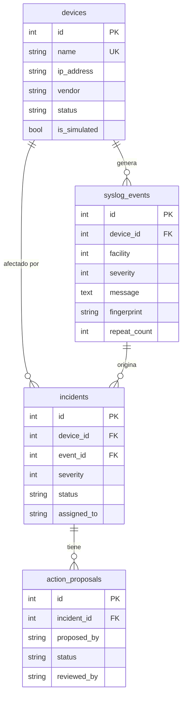
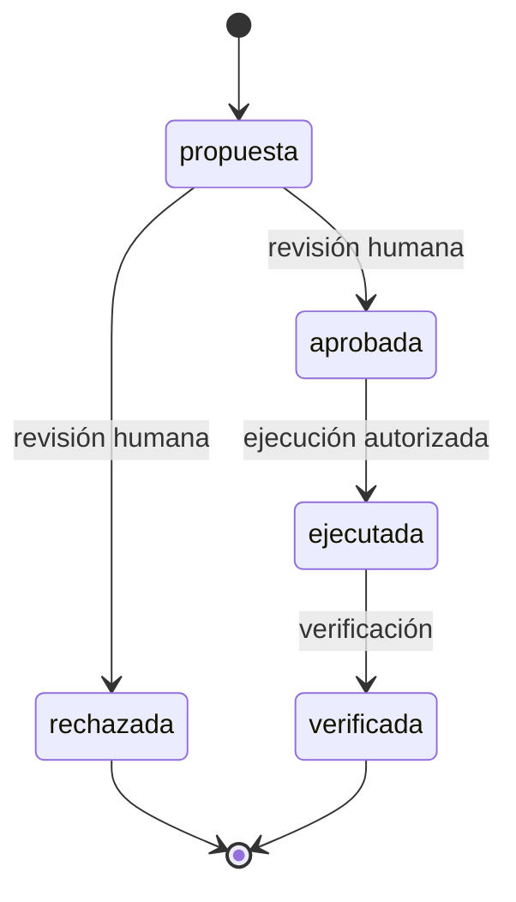

# Modelo de datos — NOC Syslog Inteligente

La base de datos (SQLite) tiene 5 tablas. Cada una responde a una
funcionalidad del MVP o a una regla de ciberseguridad del proyecto.

## 1. Tablas

| Tabla              | Propósito                                | Campos principales                                                                                           |
| ------------------ | ---------------------------------------- | ------------------------------------------------------------------------------------------------------------ |
| `devices`          | Inventario de equipos                    | nombre, IP, marca, modelo, versión, ubicación, estado, simulado, fecha de actualización                      |
| `syslog_events`    | Mensajes Syslog recibidos                | fecha de llegada, equipo, IP de origen, facility, severidad, mensaje, mensaje original, huella, repeticiones |
| `incidents`        | Incidentes y su seguimiento              | título, severidad, estado, responsable, equipo, evento de origen, resolución, fecha de cierre                |
| `action_proposals` | Acciones que requieren aprobación humana | incidente, acción, quién propone, estado, quién revisa                                                       |
| `audit_log`        | Rastro de auditoría                      | fecha, actor, acción, tabla afectada, detalle                                                                |

## 2. Relaciones

La tabla `audit_log` no tiene relaciones: registra acciones sobre cualquier
tabla y conserva el historial aunque el registro original se elimine.

## 3. Restricciones de integridad

La propia base de datos rechaza valores inválidos, aunque el código falle.

| Campo                  | Valores permitidos                                    |
| ---------------------- | ----------------------------------------------------- |
| Severidad              | 0 a 7                                                 |
| Facility               | 0 a 23                                                |
| Marca                  | Cisco, Fortinet, Huawei, Otro                         |
| Estado del equipo      | activo, inactivo, mantenimiento, desconocido          |
| Origen del evento      | simulado, real, importado                             |
| Estado del incidente   | abierto, asignado, en_progreso, cerrado               |
| Quién propone          | humano, agente_ia                                     |
| Estado de la propuesta | propuesta, aprobada, rechazada, ejecutada, verificada |

## 4. Decisiones de seguridad

- **Logs como datos no confiables:** `message` y `raw` se guardan como texto;
  nunca se ejecutan ni se entregan a una IA como instrucción.
- **Dos fechas por evento:** `received_at` (hora real de llegada) y
  `event_time` (hora que dice el mensaje, que podría ser falsa).
- **Control de tormentas:** `fingerprint` identifica mensajes repetidos y
  `repeat_count` los cuenta, en vez de crear miles de filas.
- **Mensajes sospechosos:** `flagged_suspicious` marca textos que parecen
  instrucciones dirigidas a una IA.
- **Aprobación humana:** `action_proposals` obliga a que un humano revise
  toda acción antes de ejecutarla.
- **Fechas en UTC:** permite ordenar eventos de equipos en distintas zonas horarias.

## 5. Ciclo de una propuesta de acción

