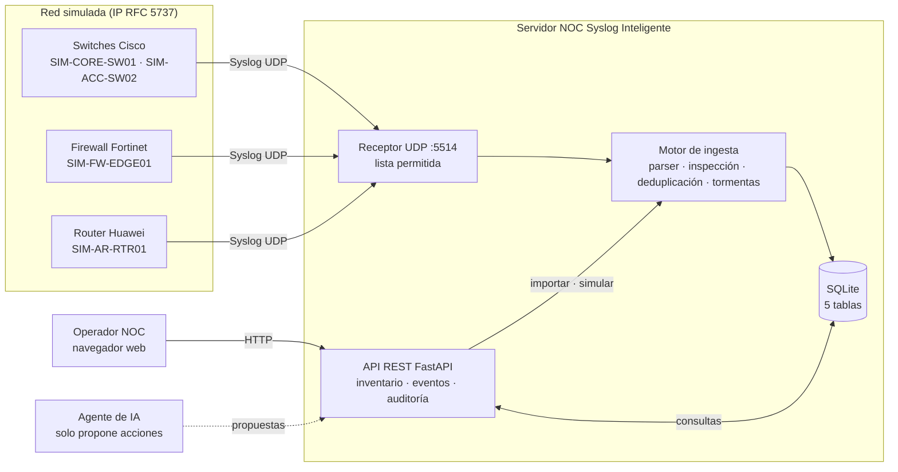
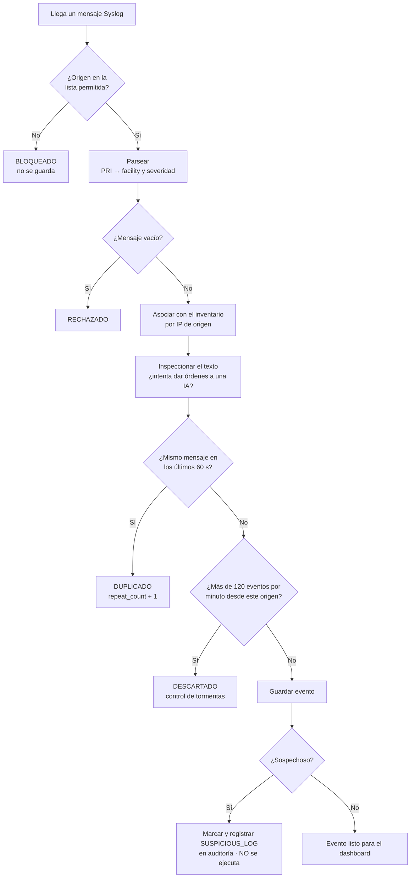
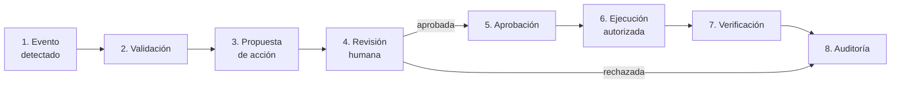
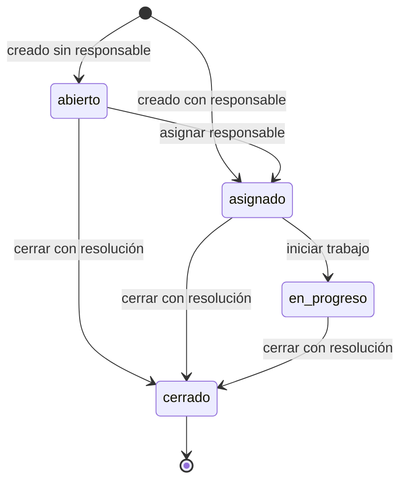

# Arquitectura y flujos — NOC Syslog Inteligente

Este documento presenta el diagrama de arquitectura del sistema, el flujo de
ingesta de mensajes Syslog y el flujo obligatorio de acciones con aprobación
humana. Los diagramas usan Mermaid y GitHub los dibuja automáticamente.

## 1. Diagrama de arquitectura

### Componentes

| Componente       | Archivo                                        | Función                                                                                                                                       |
| ---------------- | ---------------------------------------------- | --------------------------------------------------------------------------------------------------------------------------------------------- |
| Receptor UDP     | `backend/scripts/syslog_udp_listener.py`       | Escucha mensajes Syslog por red y aplica la lista permitida.                                                                                  |
| Parser           | `backend/app/syslog_parser.py`                 | Reconoce 5 formatos (RFC 3164, RFC 5424, Cisco IOS, Huawei VRP, Fortinet FortiOS) y extrae facility, severidad, equipo, aplicación y mensaje. |
| Motor de ingesta | `backend/app/ingest.py`                        | Asocia el evento al inventario, detecta inyección de instrucciones, deduplica, controla tormentas y guarda.                                   |
| Simulador        | `backend/app/simulador.py`                     | Genera mensajes simulados en el formato real de cada fabricante.                                                                              |
| API REST         | `backend/app/main.py` y `backend/app/routers/` | Expone el inventario, los eventos, las estadísticas y la auditoría.                                                                           |
| Base de datos    | `data/noc_syslog.db`                           | SQLite con 5 tablas (ver `02_modelo_datos.md`).                                                                                               |
| Dashboard        | Fase 4                                         | Interfaz web responsiva para el operador.                                                                                                     |

## 2. Flujo de ingesta de un mensaje Syslog

> La lista permitida se aplica en el receptor UDP. Los mensajes que entran por
> la API (`/api/syslog/ingest`, `/import` y `/simulate`) los envía el operador
> desde el propio sistema.

### Decisiones de seguridad del flujo

| Decisión                                                            | Razón                                                                                                 |
| ------------------------------------------------------------------- | ----------------------------------------------------------------------------------------------------- |
| Asociar equipos solo por IP de origen, no por el nombre del mensaje | El nombre dentro del log lo escribe el emisor y se puede falsificar.                                  |
| Guardar dos fechas (`received_at` y `event_time`)                   | La fecha del mensaje puede estar mal (RFC 3164 no incluye el año; relojes sin NTP) o ser falsificada. |
| Quitar caracteres de control y limitar el tamaño                    | Evita falsificar líneas extra dentro de un log y saturar la memoria.                                  |
| Deduplicar antes de controlar tormentas                             | Los mensajes repetidos nunca se pierden: solo suman al contador.                                      |
| Detectar inyección revisando todo el texto                          | Un atacante puede camuflar su mensaje con una severidad baja (5 o 6).                                 |

## 3. Flujo obligatorio de acciones

Ninguna acción sobre la red se ejecuta directamente. Todas, incluidas las que
proponga un agente de IA, siguen este flujo:

| Paso                    | Dónde se implementa                        | Estado             |
| ----------------------- | ------------------------------------------ | ------------------ |
| 1. Evento detectado     | Motor de ingesta (`ingest.py`)             | ✅ Fase 3          |
| 2. Validación           | Parser, inspección de texto, deduplicación | ✅ Fase 3          |
| 3. Propuesta de acción  | Tabla `action_proposals`                   | ⏳ Fases 4 a 6     |
| 4. Revisión humana      | Dashboard: aprobar o rechazar              | ⏳ Fases 4 a 6     |
| 5. Aprobación           | Registro de quién aprobó y cuándo          | ⏳ Fases 4 a 6     |
| 6. Ejecución autorizada | Consola simulada de solo lectura           | ⏳ Fase 5          |
| 7. Verificación         | Notas de verificación en la propuesta      | ⏳ Fases 4 a 6     |
| 8. Auditoría            | Tabla `audit_log`                          | ✅ Desde la Fase 2 |

## 4. Ciclo de vida de un incidente

| Regla                                                 | Razón                                       |
| ----------------------------------------------------- | ------------------------------------------- |
| No se pueden saltar estados                           | Primero alguien debe hacerse responsable.   |
| Cerrar exige una resolución de al menos 10 caracteres | Conservar el conocimiento de qué se hizo.   |
| Un incidente cerrado no se modifica ni se elimina     | La historia no se reescribe (trazabilidad). |
| Un evento no puede tener dos incidentes sin cerrar    | Evita trabajo duplicado entre operadores.   |

## 5. Interfaz web

El dashboard lo sirve el mismo servidor FastAPI en `http://127.0.0.1:8000/`.
Está hecho con HTML, CSS y JavaScript sin frameworks.

| Archivo               | Función                                                                                 |
| --------------------- | --------------------------------------------------------------------------------------- |
| `frontend/index.html` | Estructura de las 4 vistas: resumen, eventos, incidentes e inventario.                  |
| `frontend/styles.css` | Tema oscuro tipo NOC y diseño responsivo (una columna en pantallas de menos de 800 px). |
| `frontend/app.js`     | Consulta la API, dibuja los datos y maneja los botones y formularios.                   |

### Seguridad en el navegador

| Medida                                                | Qué evita                                                |
| ----------------------------------------------------- | -------------------------------------------------------- |
| Función `esc()` en todo texto que viene de la API     | Que un log con HTML o JavaScript se ejecute (XSS).       |
| `textContent` y `new Option()` para mensajes y listas | Que el navegador interprete texto como código.           |
| Mismo origen para la página y la API                  | No se necesita abrir CORS a otros sitios.                |
| Validación en el servidor, no solo en el formulario   | Que alguien salte las reglas usando la API directamente. |

<!-- FIN ARQUITECTURA FASE 4 -->
