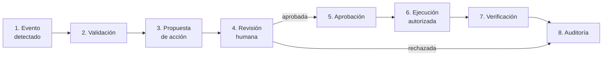

# Política de defensa frente a acciones de agentes de IA

> NOC Syslog Inteligente · v0.2.0 · Proyecto académico 2026-2
> Autor: Dany Murillo · Docente: Ing. John Harold Pérez Calderón

## 1. Propósito y alcance

Esta política define qué puede y qué no puede hacer un agente de inteligencia
artificial (IA) dentro del NOC, y cómo el sistema detecta, bloquea y registra
cualquier intento de acción no autorizada. Aplica a todo agente de IA que
consulte datos, proponga acciones o use la consola del NOC.

## 2. Principios

| Principio                  | Qué significa en el NOC                                                                                                           |
| -------------------------- | --------------------------------------------------------------------------------------------------------------------------------- |
| **Regla de oro**           | Los logs son datos no confiables. Nunca se interpretan como instrucciones, ni por una IA, ni por el navegador, ni por la consola. |
| **Humano en el bucle**     | Una IA puede proponer acciones, pero solo un humano puede aprobarlas.                                                             |
| **Mínimo privilegio**      | La consola es de solo lectura. Nadie, humano o IA, puede modificar un equipo desde el NOC.                                        |
| **Denegar por defecto**    | Solo se permite lo que está en una lista permitida. Lo demás se niega, incluso lo que nadie previó.                               |
| **Trazabilidad**           | Toda acción, permitida o rechazada, queda en la auditoría con su autor.                                                           |
| **Defensa en profundidad** | Varias capas independientes: formato, reglas del negocio, listas, suspensión y auditoría.                                         |

## 3. Qué puede y qué no puede hacer un agente de IA

| Acción                                             | ¿Permitida?                         | Control                               |
| -------------------------------------------------- | ----------------------------------- | ------------------------------------- |
| Leer eventos, incidentes e inventario              | ✅ Sí                               | API de consulta                       |
| Ejecutar comandos de consulta (show, display, get) | ✅ Sí, auditado como `agente_ia`    | Lista permitida de la consola         |
| Proponer una acción para un incidente              | ✅ Sí, si el texto no es sospechoso | `/api/proposals`                      |
| Aprobar una propuesta (incluida la suya)           | ❌ No                               | Revisión exclusivamente humana        |
| Ejecutar una acción sin aprobación                 | ❌ No                               | Estado obligatorio "aprobada"         |
| Entrar a modo configuración, reiniciar o borrar    | ❌ No                               | Lista bloqueada de la consola         |
| Encadenar comandos (`;`, `&&`)                     | ❌ No                               | Caracteres prohibidos                 |
| Obedecer instrucciones escritas dentro de un log   | ❌ No                               | Regla de oro y detección de inyección |
| Seguir actuando tras varios rechazos               | ❌ No                               | Suspensión automática                 |

## 4. Flujo obligatorio de acciones

| Paso                    | Implementación                                                                         | Endpoint o módulo                   |
| ----------------------- | -------------------------------------------------------------------------------------- | ----------------------------------- |
| 1. Evento detectado     | Motor de ingesta Syslog                                                                | `ingest.py`, receptor UDP           |
| 2. Validación           | Parser, detección de inyección, deduplicación, tormentas                               | `syslog_parser.py`, `ingest.py`     |
| 3. Propuesta            | Humano o agente de IA propone; las propuestas sospechosas del agente se rechazan solas | POST `/api/proposals`               |
| 4. Revisión humana      | Aprobar o rechazar; se niega si firma un agente                                        | POST `/api/proposals/{id}/review`   |
| 5. Aprobación           | Queda registrado quién aprobó y cuándo                                                 | Campos `reviewed_by`, `reviewed_at` |
| 6. Ejecución autorizada | Solo si está aprobada; la ejecución es simulada                                        | POST `/api/proposals/{id}/execute`  |
| 7. Verificación         | Notas de verificación obligatorias                                                     | POST `/api/proposals/{id}/verify`   |
| 8. Auditoría            | PROPOSE, APPROVE, REJECT, EXECUTE, VERIFY                                              | Tabla `audit_log`                   |

## 5. Controles técnicos implementados

| Control                           | Amenaza que mitiga                                | Dónde               | Prueba              |
| --------------------------------- | ------------------------------------------------- | ------------------- | ------------------- |
| Logs tratados como datos          | Inyección de instrucciones en logs                | `ingest.py`         | PF-F3-05            |
| Detección de patrones sospechosos | Logs y propuestas que intentan manipular a una IA | `es_sospechoso()`   | PF-F3-05, PF-F6-07  |
| Limpieza de caracteres de control | Falsificación de líneas en los logs               | `limpiar()`         | PF-F3-01            |
| Escape de HTML en el navegador    | XSS a través de los logs                          | `esc()` en `app.js` | PF-F4-18            |
| Patrones de caracteres permitidos | Inyección de configuración                        | `schemas.py`        | PF-F5-04, PF-F5-14  |
| Lista permitida de redes          | Logs falsos desde orígenes desconocidos           | Receptor UDP        | PF-F3-16            |
| Identidad por IP, no por nombre   | Suplantación de equipos                           | `ingest.py`         | PF-F3-15            |
| Deduplicación (60 s)              | Saturación por mensajes repetidos                 | `ingest.py`         | PF-F3-04            |
| Control de tormentas (120/min)    | Inundación de logs para esconder ataques          | `ingest.py`         | PF-F6-12            |
| Consola de solo lectura           | Cambios o daños en los equipos                    | `console_sim.py`    | PF-F5-07 a PF-F5-09 |
| Suspensión automática del agente  | Agente manipulado que insiste                     | `politica_ia.py`    | PF-F6-09            |
| Aprobación exclusivamente humana  | Agente que se aprueba a sí mismo                  | `politica.py`       | PF-F6-03            |
| Auditoría de todo intento         | Acciones no detectadas                            | `audit_log`         | PF-F5-12, PF-F6-13  |

## 6. Cómo Syslog ayuda a detectar acciones maliciosas de agentes de IA

1. **Visibilidad centralizada:** todos los equipos reportan al NOC. Si un agente
   actúa sobre la red, los equipos generan eventos que el NOC recibe y clasifica.
2. **Evidencia independiente:** los logs los producen los equipos, no el agente.
   Un agente no puede "borrar su rastro" en un sistema que no controla.
3. **Doble fecha:** `received_at` (hora real de llegada) frente a `event_time`
   (hora declarada) permite detectar fechas manipuladas.
4. **Listas permitidas:** solo se aceptan logs de redes autorizadas y solo se
   ejecutan comandos autorizados.
5. **Control de tormentas y deduplicación:** un agente que genere ruido masivo no
   logra saturar el NOC ni esconder eventos importantes.
6. **Detección de contenido:** los intentos de manipular a una IA se marcan como
   sospechosos, sin importar la severidad con la que se camuflen.
7. **Auditoría con actor:** cada acción queda con su autor (`operador_local`,
   `sistema` o `agente_ia`), lo que permite ver patrones de abuso.

### Señales de alerta

- Varios `CONSOLE_BLOCKED` seguidos del actor `agente_ia`.
- Registros `PROPOSAL_REJECTED_AUTO` o `REVIEW_DENIED`.
- Eventos marcados como sospechosos (`SUSPICIOUS_LOG`).
- Descartes por control de tormentas desde un mismo origen.

## 7. Respuesta ante un agente sospechoso

1. **Automático:** tras 3 acciones rechazadas en 10 minutos, el agente queda
   suspendido y todo lo que pida se rechaza (`/api/policy/agent-status`).
2. **Revisión humana:** el analista revisa en la auditoría qué intentó el agente.
3. **Investigación:** se buscan logs sospechosos que puedan haberlo manipulado.
4. **Decisión:** se corrige la causa antes de volver a usar el agente.
5. **Registro:** se documenta el caso como incidente, con su resolución.

## 8. Limitaciones y trabajo futuro (v1.0.0)

- **Autenticación con roles:** hoy la identidad del revisor es declarada; en la
  v1.0.0 solo usuarios humanos autenticados con rol de aprobador podrán aprobar.
- **Cifrado:** HTTPS para el dashboard y Syslog sobre TLS (RFC 5425).
- **Auditoría inmutable:** encadenar los registros con hashes para detectar
  cualquier alteración.
- **Liberación manual de la suspensión** por parte de un administrador.
- **Alertas activas** (correo o mensajería) ante suspensiones y tormentas.

<!-- FIN POLÍTICA -->
